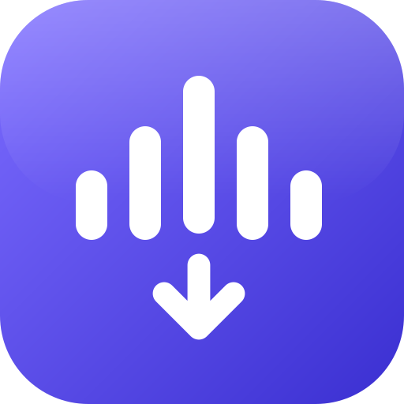
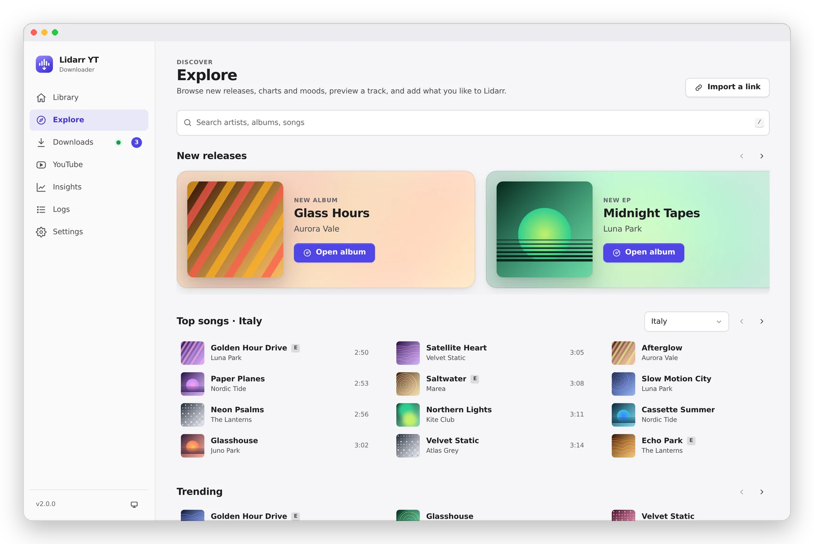
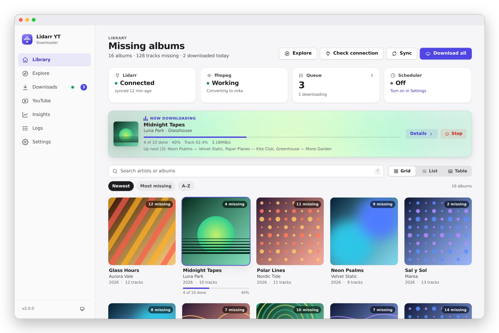
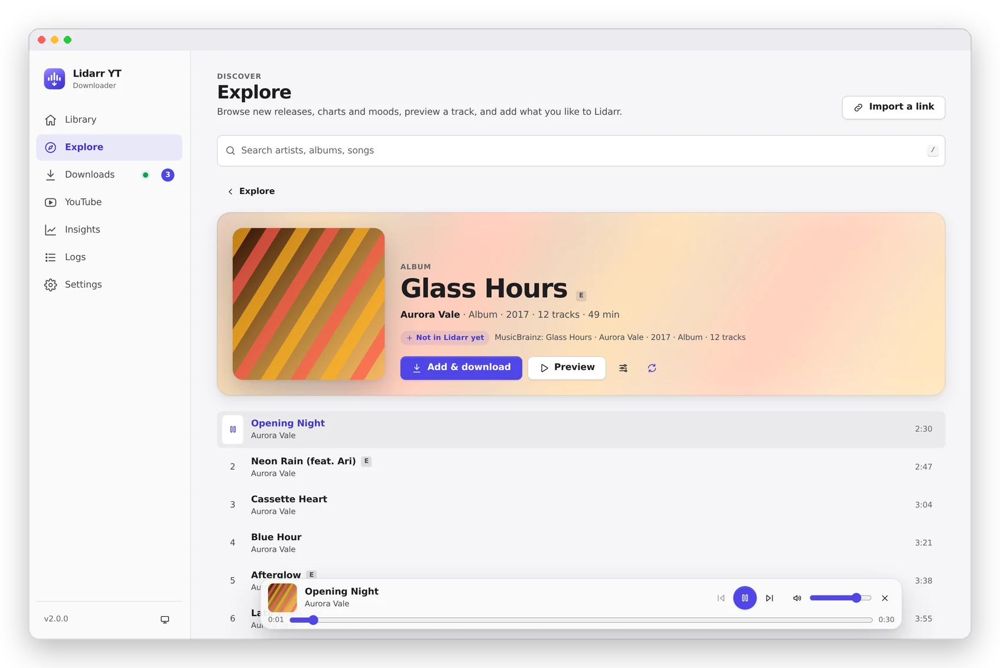
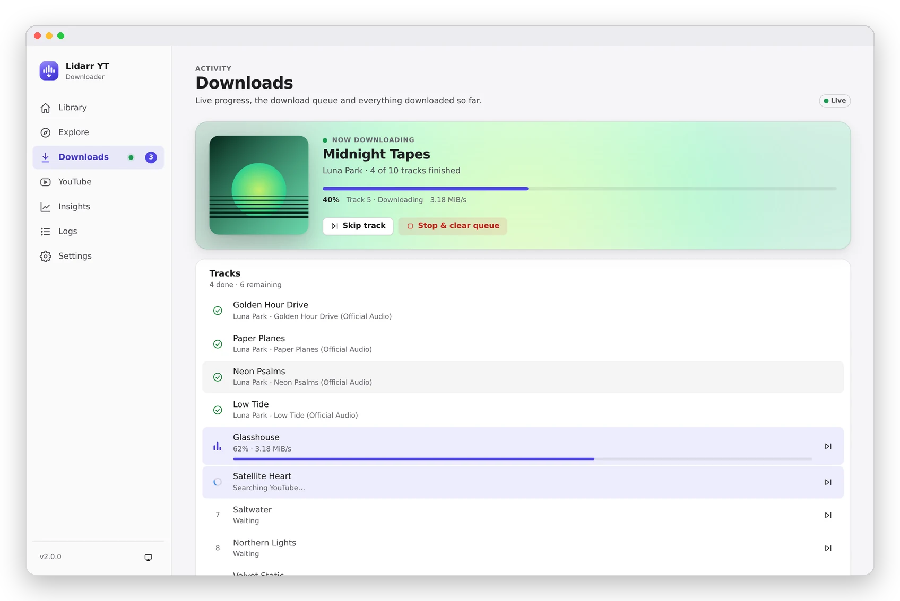
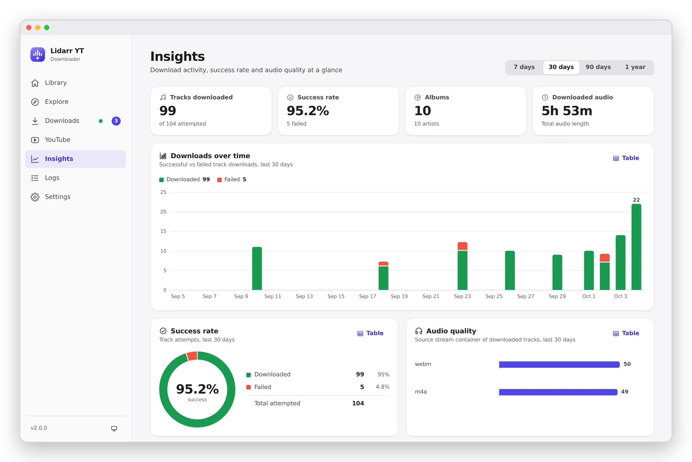
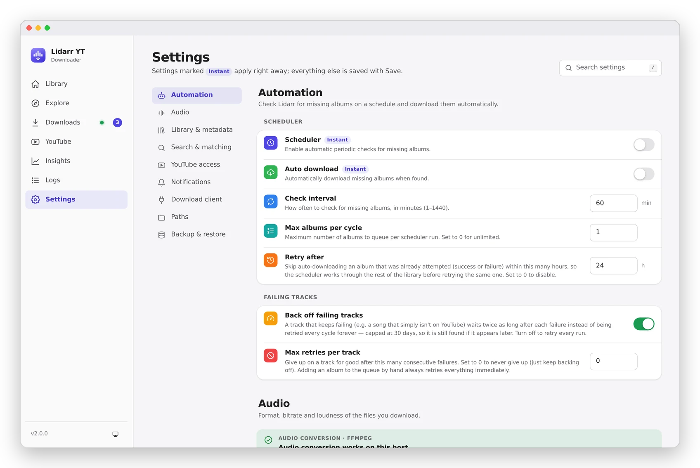
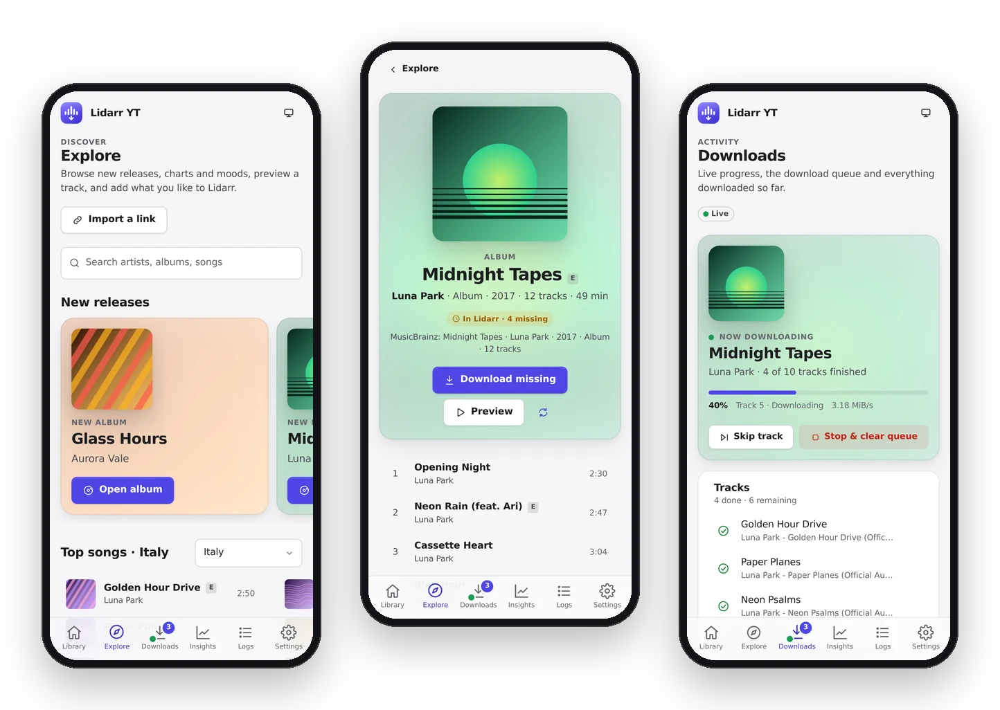

<div align="center">



# Lidarr YouTube Downloader

**Fill the gaps in your Lidarr library from YouTube.**<br>
Missing albums found, matched, verified, tagged and imported — from one quiet, beautiful web app.

[](CHANGELOG.md)
[](#quick-start)
[](requirements.txt)
[](LICENSE)

[Quick start](#quick-start) · [Features](#features) · [Explore](#explore) · [Configuration](#configuration) · [FAQ](#faq)

<br>

<picture>
  <source media="(prefers-color-scheme: dark)" srcset="docs/screenshots/explore-dark.webp">
  
</picture>

</div>

<br>

## Features

<table>
<tr>
<td width="33%" valign="top">

**Smart matching**<br>
<sub>Up to 15 YouTube candidates per track, scored by title, duration, official channel and the official YouTube Music album.</sub>

</td>
<td width="33%" valign="top">

**Verified audio**<br>
<sub>Optional AcoustID fingerprinting rejects the wrong song before it ever reaches your library.</sub>

</td>
<td width="33%" valign="top">

**Complete tags**<br>
<sub>MP3, M4A or Opus with MusicBrainz ids and embedded cover art; optional synced lyrics and ReplayGain.</sub>

</td>
</tr>
<tr>
<td valign="top">

**Native to Lidarr**<br>
<sub>Files land in your library and Lidarr refreshes — or register the app as a Newznab indexer + SABnzbd client.</sub>

</td>
<td valign="top">

**Explore**<br>
<sub>Browse releases, charts and moods, preview any track and add it to Lidarr in two clicks.</sub>

</td>
<td valign="top">

**Runs anywhere**<br>
<sub>One Docker container for NAS, Unraid, Synology, Raspberry Pi or a VPS. Installable as an app.</sub>

</td>
</tr>
</table>

<br>

### Your library, at a glance

Every album Lidarr is missing, with cover art and live status. Download one, select many, or let the scheduler fetch new releases on its own.

<picture>
  <source media="(prefers-color-scheme: dark)" srcset="docs/screenshots/library-dark.webp">
  
</picture>

<br>

### Explore

A music catalog inside the app. Open an album and it is already matched to MusicBrainz through Lidarr: **Add & download** puts it in Lidarr and downloads it straight from the YouTube Music album you were looking at.

<picture>
  <source media="(prefers-color-scheme: dark)" srcset="docs/screenshots/album-dark.webp">
  
</picture>

- **Preview before you download** — a mini player streams any track.
- **Every state, one button** — complete, missing tracks, not monitored, not in Lidarr, several matches to pick from.
- **Not on MusicBrainz?** Albums, playlists and whole artists are added from YouTube in a Lidarr-style `Artist/Album (Year)` layout, with covers and an `artist.jpg`.

<br>

### Live downloads

Per-track progress, speed and verification, a reorderable queue, and a history you can filter by outcome and audio quality.

<picture>
  <source media="(prefers-color-scheme: dark)" srcset="docs/screenshots/downloads-dark.webp">
  
</picture>

<br>

### Insights and settings

Success rate, audio quality and activity over time — and every option in one calm, sectioned page.

<p align="center">
<picture>
  <source media="(prefers-color-scheme: dark)" srcset="docs/screenshots/insights-dark.webp">
  
</picture>
<picture>
  <source media="(prefers-color-scheme: dark)" srcset="docs/screenshots/settings-dark.webp">
  
</picture>
</p>

<br>

### Made for your phone too

Light and dark themes, touch-sized controls and a tab bar. Add it to your home screen and it opens like an app.

<p align="center">
<picture>
  <source media="(prefers-color-scheme: dark)" srcset="docs/screenshots/mobile-dark.webp">
  
</picture>
</p>

<br>

## Quick start

```yaml
services:
  lidarr-downloader:
    image: angrido/lidarr-downloader:latest
    container_name: lidarr-downloader
    ports:
      - "5005:5000"
    volumes:
      - ./config:/config
      - /DATA/Downloads:/DATA/Downloads
      - /DATA/Media/Music:/music
    environment:
      - LIDARR_URL=http://192.168.1.XXX:8686
      - LIDARR_API_KEY=your_api_key_here
      - DOWNLOAD_PATH=/DATA/Downloads
      - LIDARR_PATH=/music
      - PUID=1000
      - PGID=1000
      - UMASK=002
    restart: unless-stopped
```

```bash
docker compose up -d
```

Open **`http://localhost:5005`** — a short setup wizard checks the Lidarr connection, and everything else lives in **Settings**.

> [!TIP]
> The repository's [`docker-compose.yml`](docker-compose.yml) also starts a [bgutil PO-token provider](https://github.com/Brainicism/bgutil-ytdlp-pot-provider) sidecar, which avoids most *"Sign in to confirm you're not a bot"* errors.

<br>

## How it works

| Step | What happens |
|---|---|
| **1 · Sync** | Lidarr's missing albums are paged into a local SQLite cache, so the UI is instant. |
| **2 · Search** | The official YouTube Music album is tried first, then up to 15 candidates per track. |
| **3 · Score** | Title, duration window, official channel and forbidden words (remix, live, karaoke…). |
| **4 · Verify** | Optional AcoustID fingerprint against the expected MusicBrainz recording. |
| **5 · Tag** | Tags, MusicBrainz ids and cover art; optional `.lrc` lyrics, ReplayGain and XML sidecar. |
| **6 · Import** | Files are copied into your library and Lidarr refreshes the artist. |

<br>

## Configuration

| Variable | Example | Description |
|---|---|---|
| `LIDARR_URL` | `http://192.168.1.10:8686` | Lidarr base URL (use the LAN IP) |
| `LIDARR_API_KEY` | `abc123…` | Lidarr → Settings → General |
| `DOWNLOAD_PATH` | `/DATA/Downloads` | Where new tracks are saved |
| `LIDARR_PATH` | `/music` | Your music library, as mounted in the container |
| `PUID` / `PGID` / `UMASK` | `1000` / `1000` / `002` | File ownership, matching Lidarr |

Audio format and quality, parallel tracks, match threshold, forbidden words, scheduler, notifications (Telegram, Discord, ntfy), AcoustID and yt-dlp tuning are all set in **Settings**. Explore's default region and language come from `EXPLORE_COUNTRY` (default `IT`) and `EXPLORE_LANGUAGE` (default `en`); the chart country can also be switched right on the Explore page.

<details>
<summary><b>YouTube cookies</b> — when YouTube asks you to sign in</summary>

<br>

1. Install the **Get cookies.txt LOCALLY** browser extension.
2. In a private window, sign in to a **throwaway** Google account.
3. Export the cookies in **Netscape** format as `cookies.txt`.
4. Mount it and point the app at it:

```yaml
volumes:
  - ./cookies.txt:/cookies/cookies.txt
environment:
  - YT_COOKIES_FILE=/cookies/cookies.txt
```

Never use your main Google account: cookies expire and accounts can be flagged. The app never modifies your file — every download works on a private copy.

</details>

<details>
<summary><b>AcoustID fingerprinting</b> — verify every track</summary>

<br>

Enable it in Settings and paste an [AcoustID API key](https://acoustid.org/new-application). The image already ships `fpcalc` (chromaprint).

</details>

<details>
<summary><b>Use as a Lidarr download client</b> — let Lidarr drive the whole flow</summary>

<br>

The app can register **inside Lidarr** as a Newznab indexer and a SABnzbd download client. Lidarr then searches, grabs, monitors and imports exactly as it would with Usenet.

| Surface | Emulates | Endpoint |
|---|---|---|
| Indexer | Newznab | `/api/newznab/api` |
| Download client | SABnzbd | `/api/sabnzbd` |

1. **This app → Settings → Lidarr Download Client**: enable it, **Generate** an API key, set a **Category** (default `music`) and save.
2. **Lidarr → Settings → Indexers → + → Newznab** (custom): URL `http://<this-app-host>:<port>`, API Path `/api/newznab/api`, the API key. Test, then save.
3. **Lidarr → Settings → Download Clients → + → SABnzbd**: this app's host and port, URL Base `/api/sabnzbd`, the same key and category. Test, then save.
4. **Lidarr → Settings → Media Management**: enable **Completed Download Handling**.

In this mode files stay in the download folder for Lidarr to import, so that folder must be visible to Lidarr at the same path (or through a remote path mapping). Albums attempted recently are held back for `scheduler_retry_after_hours` (default 24 h) so a failing album is not grabbed again and again. With **RSS sync** on, Lidarr grabs missing albums from the feed automatically; turn RSS off on the indexer if you only want explicit searches.

</details>

<details>
<summary><b>Upgrading from the JSON state of old versions</b></summary>

<br>

```bash
docker exec -it lidarr-downloader python3 tools/migrate_json_to_db.py --config-dir /config
```

The originals are renamed to `*.json.migrated`.

</details>

<br>

## FAQ

<details>
<summary><b>Does it replace a real indexer?</b></summary>
<br>
No — it is a fallback for albums your indexers can't find. Audio quality is limited to what YouTube serves.
</details>

<details>
<summary><b>Does it work with Plex, Jellyfin or Navidrome?</b></summary>
<br>
Yes. Files are imported into Lidarr's library, where any music server picks them up.
</details>

<details>
<summary><b>Which audio formats are supported?</b></summary>
<br>
MP3 (up to 320 kbps), M4A and Opus, selectable in Settings. M4A keeps YouTube's native stream without re-encoding.
</details>

<details>
<summary><b>Can I download a playlist or a single video?</b></summary>
<br>
Yes. Paste any YouTube or YouTube Music link on the <b>YouTube</b> page, or open a playlist in Explore and pick the tracks.
</details>

<details>
<summary><b>What about artists that aren't on MusicBrainz?</b></summary>
<br>
Lidarr can't track them, so Explore offers <b>Add from YouTube</b>: one click creates the artist folder with one folder per release, tagged and with covers. Running it again later only fetches new releases.
</details>

<details>
<summary><b>Is yt-dlp kept up to date?</b></summary>
<br>
It is checked at startup, and Settings upgrades it with one click.
</details>

<br>

## Development

```bash
git clone https://github.com/Angrido/Lidarr-YouTube-Downloader.git
cd Lidarr-YouTube-Downloader
python -m venv .venv && source .venv/bin/activate
pip install -r requirements.txt
python app.py                     # http://localhost:5000
python -m pytest tests/           # test suite
python tools/explore_preview.py --demo   # UI with demo data, no Lidarr or downloads
```

The screenshots above come from `tools/explore_preview.py --demo`: artists, albums and covers are generated, not real.

<br>

## Disclaimer

For **personal use** with your own music library. You are responsible for complying with copyright law and YouTube's Terms of Service. Explore reads public YouTube Music pages through the unofficial [ytmusicapi](https://github.com/sigma67/ytmusicapi) library and is not affiliated with or endorsed by YouTube or Google; what it shows depends on what YouTube serves to your server and can change without notice.

<br>

<div align="center">

<a href="https://www.star-history.com/?repos=Angrido%2FLidarr-YouTube-Downloader&type=date&legend=top-left">
 <picture>
   <source media="(prefers-color-scheme: dark)" srcset="https://api.star-history.com/image?repos=Angrido/Lidarr-YouTube-Downloader&type=date&theme=dark&legend=top-left" />
   <source media="(prefers-color-scheme: light)" srcset="https://api.star-history.com/image?repos=Angrido/Lidarr-YouTube-Downloader&type=date&legend=top-left" />
   
 </picture>
</a>

<sub>Made with care for the self-hosted music community · MIT licensed</sub>

</div>
